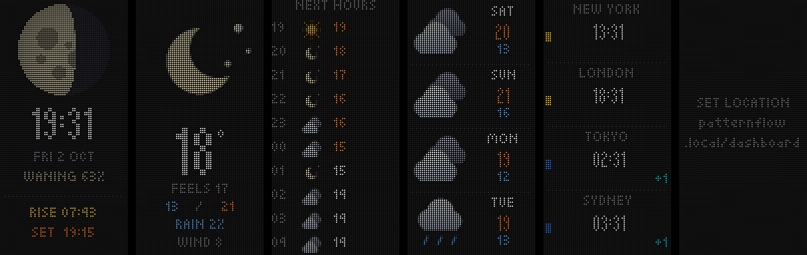
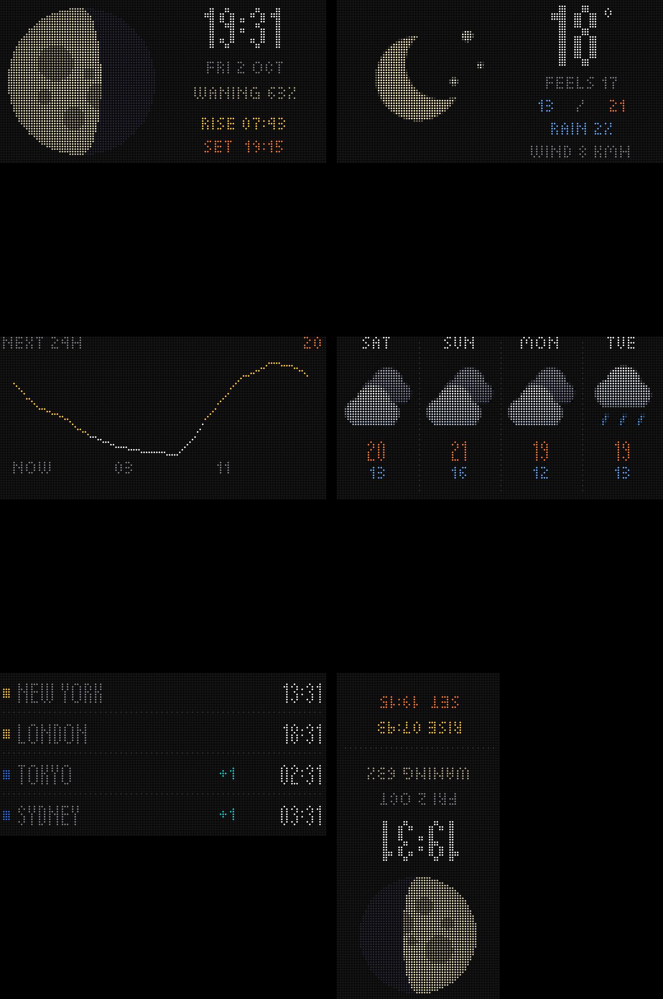

# Patternflow Dashboard

A community edition of [Patternflow](https://github.com/engmung/Patternflow), the open-source LED synthesizer. It adds two things and changes nothing else:

- **Game of Life**: a pattern you play with the four knobs. Install it like any other pattern.
- **Dashboard**: a clock with moon phase, weather now, the next hours, the next days and world clocks, with your own GIFs in between. It shows up as an extra entry in the K4 pattern browser.
- **Night mode**: the whole panel sleeps at night (default 22:00–08:00), whatever pattern is running.

<p align="center"></p>

> **Status:** early. Everything builds and passes its tests on a computer, with real weather data. Nothing has run on real Patternflow hardware yet.

## How it relates to Patternflow

This is **not a fork**. The repository only holds our own code. `build.sh` fetches a pinned Patternflow version, copies our feature into it the way Patternflow's [editions](https://github.com/engmung/Patternflow/blob/main/docs/EDITIONS.md) are meant to work, and builds it. No Patternflow file is ever edited, so a new Patternflow version is a one-line change (`PATTERNFLOW_VERSION`).

Switching between this edition and the official one keeps your patterns, Wi-Fi networks and settings. You can always go back to official Patternflow.

## Game of Life

| Knob | Turn | Press |
|---|---|---|
| **K1** | speed: 1–60 generations per second | pause / resume |
| **K2** | density of a new world | new world, in the next seed style: random, mirrored, methuselahs |
| **K3** | color theme (ocean, fire, matrix, neon) | next rule: Life, HighLife, Day & Night |
| **K4** | length of the trail dead cells leave | sprinkle live cells into a dying world |

The long presses stay Patternflow's own (K4 held = pattern browser).

Cells fade in when they are born, shift color as they age and leave a trail when they die. The world wraps around at the edges. It runs until it is truly finished: once the whole grid repeats an earlier state, nothing new can ever happen. That covers still lifes, blinkers, and gliders that loop around forever. The end state stays visible for 8 seconds, then the world dissolves and a new one grows. At the default speed (4 generations per second) a classic random world lasts about 6 minutes on average, sometimes over 20.

**Try it without hardware:** paste [`patterns/game-of-life/game-of-life.js`](patterns/game-of-life/game-of-life.js) into the [Patternflow Live Editor](https://patternflow.work/pattern).

**Install it on a panel:** download `game_of_life.pfm` from the [releases](../../releases) and drop it on your panel's patterns page (`http://patternflow.local/patterns`).

## Dashboard

<p align="center"></p>

Pick **Dashboard** in the K4 pattern browser. It rotates through five screens: clock with moon phase and sunrise/sunset (20 s), weather now, the next hours, the next four days and world clocks (10 s each). A GIF plays after every screen, if you have uploaded any (at least one full loop, at most 20 s). Every screen has a portrait layout (Patternflow's usual mounting) and a landscape one.

| Knob | Turn | Press |
|---|---|---|
| **K1** | previous / next screen (stays there for a minute) | automatic rotation on / off |
| **K2** | orientation by hand: portrait, landscape, or either upside down | |
| **K4** | | back to the pattern you had before the dashboard |

**Set your location** at `http://patternflow.local/dashboard`: type a city, pick it from the list. The browser looks the place up; the panel only stores its coordinates, in its own settings space. Weather comes from [Open-Meteo](https://open-meteo.com/) (free, no API key) every 15 minutes. The fetch runs on the ESP32's second core, so the panel never stutters while it loads.

The weather icons are drawn from shapes rather than bitmaps, so they stay sharp at 64, 32 and 12 pixels. The home timezone is Central European Time with daylight saving (`DASH_TZ` in `feature/dashboard/dashboard_config.h`).

### World clocks

Up to four, set on `http://patternflow.local/dashboard`: search a city, rename it if you like (up to 10 characters), save. With no clocks the screen is skipped.

The panel has no time zone database, so the page derives each city's daylight saving rule from your browser's database. It finds the two switch moments of the year and describes them the way a POSIX TZ rule does ("last Sunday of September, 2:00"), checking that the description holds for the next seven years. The panel then works the time out by itself, without internet. Tested against the tz database for all 416 zones, every half hour from 2025 to 2030: 410 match exactly. Morocco (Casablanca, El Aaiún) switches around Ramadan, which no fixed rule can describe. Its clock keeps standard time, and the page says so. Palestine (Gaza, Hebron) is partly tied to Ramadan too, so in some years its clock is an hour off for about two weeks. The other two differences (Edmonton, Vancouver) are where two editions of the tz database disagree after a 2026 rule change, not errors in the rule.

### GIFs

Upload them on the same page, `http://patternflow.local/dashboard`. Pick a GIF file, drag one in from another tab, or paste a link: a Giphy page (`giphy.com/gifs/…`) works as it is, and for other sites the GIF's own address ("Copy image address"). The browser does the work: it decodes it, shows a live preview in portrait and landscape, and converts it. You choose between *whole GIF* (black bars) or *fill* (cropped), and sharp (pixel art) or smooth scaling. For wide GIFs (two characters side by side, say), *split* puts the left half above the right half in portrait, so they stay big. It is switched on automatically for GIFs at least 1.6 times as wide as they are tall. The panel stores a portrait and a landscape version, in a 252-colour palette at one byte per pixel (8 KB per frame). While another screen shows, it reads the next GIF into PSRAM in small steps and then plays it from there, so playback never holds up the flash or Wi-Fi. GIFs with more than 120 frames are thinned out so the whole animation still fits. Delete them from the list on the same page.

### Automatic rotation (optional accelerometer)

With an accelerometer the dashboard turns with the panel: portrait, landscape, and either way up. Patternflow's own patterns are drawn for one fixed way up, so they can only turn 180 degrees. They do that when the panel hangs upside down (switch it off on the settings page). Without the sensor nothing changes: K2 rotates by hand. Switch the sensor on on the settings page once it is wired: GPIO43/44 are also the board's serial console, so they are left alone until then.

**Hardware:** an [Adafruit LIS3DH](https://www.adafruit.com/product/2809) (STEMMA QT) and a [STEMMA QT cable with female sockets](https://www.adafruit.com/product/4397), no soldering:

| LIS3DH | ESP32-S3 DevKit |
|---|---|
| 3V3 (red) | 3V3 |
| GND (black) | GND |
| SDA (blue) | GPIO43 (TX) |
| SCL (yellow) | GPIO44 (RX) |

GPIO43/44 are the only free header pins on the Patternflow board. The Audio edition uses the same two for its microphone, so you can't have both at once.

**Calibrate once** on `http://patternflow.local/dashboard`: hang the panel upright (portrait) and press *This is upright*. If the dashboard then reads upside down in portrait or in landscape, press the matching button. The sensor is read in a task on the second core, and readings that can't be gravity (lying flat, being moved) are ignored. A missing or failing sensor can never stall the panel.

### Night mode

The panel sleeps from 22:00 to 08:00 by default. Change the times or switch it off on `http://patternflow.local/dashboard`. It uses Patternflow's own sleep: the LEDs are off and the board idles, but it stays on Wi-Fi. Any knob or button wakes it. Woken during the night, it goes back to sleep after 10 minutes without a knob being touched. Night mode works whatever pattern is running, not only on the dashboard.

### Trying the settings page without a panel

```bash
./build.sh                       # once: fetches Patternflow, whose console chrome the page uses
python3 tools/mock_panel.py      # then open http://localhost:8765/dashboard
```

This serves the real page (`feature/dashboard/dashboard.html`) with Patternflow's console chrome and pretends to be a panel. The page is built from Patternflow's own console pages; `build.sh` stamps and gzips it with Patternflow's `console_pages.py`. Uploaded clips land in `.mock_panel/`.

<details><summary>Landscape layouts</summary>



</details>

## Installing the edition

1. Build and set up Patternflow as usual ([guide](https://patternflow.work/guide)), so it is on your Wi-Fi.
2. Download `patternflow-dashboard-….bin` from the [releases](../../releases).
3. Open `http://patternflow.local/update` and drop the file on it. The panel restarts.

To go back, install the official firmware from the [Patternflow editions shelf](https://patternflow.work/editions).

## Building it yourself

You need git, curl and Python 3.10 or newer (the Python that ships with macOS is too old):

```bash
python3 -m venv .venv
.venv/bin/pip install platformio
./build.sh                                # → dist/*.bin and dist/*.pfm
./build.sh flash patternflow.local        # build and install over Wi-Fi
PF_VERSION=v3.11.0 ./build.sh             # try another Patternflow version
```

The first build downloads the ESP32 toolchain, which takes a few minutes.

Releases are built by GitHub Actions: push a tag such as `v0.2.0` and the firmware and patterns appear as a release.

## Layout

| Path | What it is |
|---|---|
| `feature/dashboard/` | the Patternflow feature: copied into `firmware/patternflow/features/` at build time. `preset_dashboard.h` has the screens, `dash_weather.h` the Open-Meteo fetch, `dash_icons.h` the icons, `dash_gifs.h` the GIF player, `dash_night.h` night mode, `dash_accel.h` the accelerometer, `dash_http.h` the settings page (including the in-browser GIF decoder) |
| `tools/mock_panel.py` | a pretend panel for trying the settings page |
| `edition/` | the edition's two files: which features it carries, and its name and version |
| `patterns/` | patterns, each as a C++ header (for the panel) and a JavaScript twin (for the Live Editor) |
| `build.sh` | fetches Patternflow, adds our files, builds firmware and patterns |
| `PATTERNFLOW_VERSION` | the Patternflow release this edition builds against |

## License

Code: [MIT](LICENSE). Patterns: CC BY-SA 4.0, like Patternflow's own patterns.
