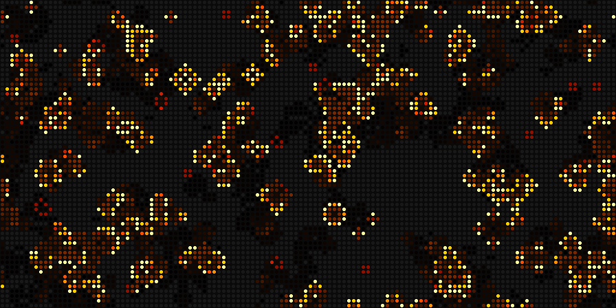

# Patternflow Dashboard

A community edition of [Patternflow](https://github.com/engmung/Patternflow), the open-source LED synthesizer. It adds two things and changes nothing else:

- **Game of Life**: a pattern you play with the four knobs. Install it like any other pattern.
- **Dashboard** (work in progress): a clock with moon phase, weather, forecast and world clocks. It shows up as an extra entry in the K4 pattern browser.

<p align="center"></p>

> **Status:** early. The firmware and the Game of Life pattern build and pass their tests. Neither has run on real hardware yet. The dashboard is only a big clock so far.

## How it relates to Patternflow

This is **not a fork**. The repository only holds our own code. `build.sh` fetches a pinned Patternflow version, copies our feature into it the way Patternflow's [editions](https://github.com/engmung/Patternflow/blob/main/docs/EDITIONS.md) are meant to work, and builds it. No Patternflow file is ever edited, so a new Patternflow version is a one-line change (`PATTERNFLOW_VERSION`).

Switching between this edition and the official one keeps your patterns, Wi-Fi networks and settings. You can always go back to official Patternflow.

## Game of Life

| Knob | Turn | Press |
|---|---|---|
| **K1** | speed: 1–60 generations per second | pause / resume |
| **K2** | density of a new world | new world |
| **K3** | color theme (ocean, fire, matrix, neon) | next theme |
| **K4** | length of the trail dead cells leave | sprinkle live cells into a dying world |

The long presses stay Patternflow's own (K4 held = pattern browser).

The world wraps around at the edges. It runs until it is truly finished: once the whole grid repeats an earlier state, nothing new can ever happen. That covers still lifes, blinkers, and gliders that loop around forever. The end state stays visible for 40 generations, then a new world starts.

**Try it without hardware:** paste [`patterns/game-of-life/game-of-life.js`](patterns/game-of-life/game-of-life.js) into the [Patternflow Live Editor](https://patternflow.work/pattern).

**Install it on a panel:** download `game_of_life.pfm` from the [releases](../../releases) and drop it on your panel's patterns page (`http://patternflow.local/patterns`).

## Installing the edition

1. Build and set up Patternflow as usual ([guide](https://patternflow.work/guide)), so it is on your Wi-Fi.
2. Download `patternflow-dashboard-….bin` from the [releases](../../releases).
3. Open `http://patternflow.local/update` and drop the file on it. The panel restarts.

To go back, install the official firmware from the [Patternflow editions shelf](https://patternflow.work/editions).

## Building it yourself

You need git, curl and Python 3.10 or newer (the Python that ships with macOS is too old):

```bash
python3 -m venv .venv
.venv/bin/pip install platformio
./build.sh                                # → dist/*.bin and dist/*.pfm
./build.sh flash patternflow.local        # build and install over Wi-Fi
PF_VERSION=v3.11.0 ./build.sh             # try another Patternflow version
```

The first build downloads the ESP32 toolchain, which takes a few minutes.

Releases are built by GitHub Actions: push a tag such as `v0.2.0` and the firmware and patterns appear as a release.

## Layout

| Path | What it is |
|---|---|
| `feature/dashboard/` | the Patternflow feature: copied into `firmware/patternflow/features/` at build time |
| `edition/` | the edition's two files: which features it carries, and its name and version |
| `patterns/` | patterns, each as a C++ header (for the panel) and a JavaScript twin (for the Live Editor) |
| `build.sh` | fetches Patternflow, adds our files, builds firmware and patterns |
| `PATTERNFLOW_VERSION` | the Patternflow release this edition builds against |

## License

Code: [MIT](LICENSE). Patterns: CC BY-SA 4.0, like Patternflow's own patterns.
